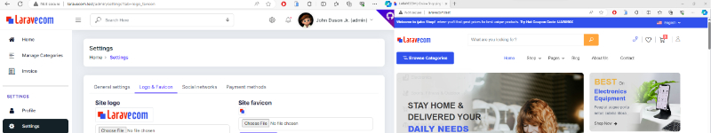

<p align="center">
<a href="https://laravel.com" target="_blank"></a></p>


# Build Laravel 10 Multi-Vendor eCommerce

You'll learn how to build your own e-commerce web application using the most powerful and user-friendly php framework available to web developers, Laravel.
By the end of the course, you will also be able to build and add powerful features to your web Laravel e-commerce including PayPal Payment System or Stripe Payment Gateway.


## Get Started

After download Laravel 10 Multi Vendor e-commerce project draft, you can follow the following steps for better start up.

`1.` Extract the zip file and put (laravecom) folder in your desired place ( xampp > htdocs) recommended. 
   Then open that folder in your favorite text editor. ( Visual Studio Code -> recommended )
   And run "php artisan optimize:clear" and "composer update" commands

`2.` Create new database in phpMyAdmin rename to (laravecom_db) and import tables using a given laravecom_db.sql file from downloaded root folder.

```sql
  DB_CONNECTION=mysql
  DB_HOST=127.0.0.1
  DB_PORT=3306
  DB_DATABASE=laravecom_db
  DB_USERNAME=root
  DB_PASSWORD=
```

`3.` Update .env file on mail configuration variables with your own mailtrap credentials:
```sql
  EMAIL_HOST='sandbox.smtp.mailtrap.io'
  EMAIL_USERNAME='yourMailTrapUsername'
  EMAIL_PASSWORD='yourMailTrapPassword'
  EMAIL_ENCRYPTION='TLS'
  EMAIL_PORT=587
  EMAIL_FROM_ADDRESS='info@laravecom.test'
  EMAIL_FROM_NAME='Laravecom'
  ```

`4.` Create virtual host (if you want to)
   
  Open notepad as administrator and open file in "C:\xampp\apache\conf\extra\httpd-vhosts.conf" 
  path and define your own virtual host:
```bash
    <VirtualHost *:80>
        DocumentRoot "C:/xampp/htdocs/laravecom/public"
        ServerName laravecom.test
    </VirtualHost>
```

  Also open "C:\Windows\System32\drivers\etc\hosts" to add a host

  127.0.0.1           laravecom.test

`5.` run "composer dump-autoload" command

`6.` If you did not make a virtual host, just run "php artisan serve" command
   to run project. Otherwise use "http://laravecom.test/" url in browser to run a project

`7.` Users credentials

  **ADMIN**
   - Username: admin
   - Email: admin@email.com
   - Password: 12345

  **SELLER**
   - Username: seller2
   - Email: seller2@gmail.com
   - Password: 12345

`8.` URLS

 * HOME Url: http://laravecom.test/

 * ADMIN Login Url: http://laravecom.test/admin/login

 * SELLER LOGIN Url: http://laravecom.test/seller/login 

`9.` Enjoy your coding....

<br>

We would like to recommend to watch our videos from playlist. Below are videos of that course on our YouTube Channel.

### YouTube Playlist Videos

- [#1 Introduction](https://youtu.be/nXPPrLJZlmM)
- [#2 Download and Install Laravel 10 in PC](https://youtu.be/ZYDHm3xXwBE)
- [#3 Setup .env and Database](https://youtu.be/sMrjYfdwNFw)
- [#4 Create Migrations , Models & Guards](https://youtu.be/LUxuc4FuMpM)
- [#5 Download and Integrate Admin Template](https://youtu.be/Qkz3pXLR63I)
- [#6 Create Custom Routes Files](https://youtu.be/zOv_CqyUpdk)
- [#7 Admin Auth Login](https://youtu.be/mRHV9oNA4Qg)
- [#8 Prevent Back History](https://youtu.be/IYgTITfxams)
- [#9 Admin Forgot Password](https://youtu.be/esuobLmjsQI)
- [#10 Admin Reset Password](https://youtu.be/rbcMysJw4hc)
- [#11 Setup Admin Profile](https://youtu.be/rmcjBuFsDWQ)
- [#12 Update Admin Profile Picture](https://youtu.be/gR7cwIcK86o)
- [#13 Admin Change Password](https://youtu.be/u74jrG9BiLE)
- [#14 Add Active Class to Menu Items](https://youtu.be/K0Ai0zOYFQk)
- [#15 Settings](https://youtu.be/9IIedGTmuiQ)
- [#16 Change Logo](https://youtu.be/VT7_WGegQCA)
- [#17 Change Favicon](https://youtu.be/S_WzKnf0G9o)
- [#18 Social Networks](https://youtu.be/-dL93Yw8eKU)
- [#19 Integrate Frontend Template](https://youtu.be/_INkqx7Ph-g)
- [#20 Display Site Info On Frontend](https://youtu.be/p-GfDmgxmek)
- [#21 Categories CRUD -  Setup Categories List  Page](https://youtu.be/sb-MyigUsek)
- [#22 Categories CRUD - Add Category](https://youtu.be/0szULapdYCI)
- [#23 Categories CRUD - Display Categories](https://youtu.be/PFtGqWzyS4Q)
- [#24 Categories CRUD - Update Category](https://youtu.be/fLracjT8_ZI)
- [#25 Categories CRUD - ReOrder Categories](https://youtu.be/1uAQTBEbqio)
- [#26 Categories CRUD - Delete Category](https://youtu.be/j4psqSa97PQ)
- [#27 Categories CRUD - Add Sub Category](https://youtu.be/d6Tx9yGWuDg)
- [#28 Categories CRUD - Display Sub Categories](https://youtu.be/RM4gnptzMuA)
- [#29 Categories CRUD - Edit & Update Sub Category](https://youtu.be/tYDevyxw5hY)
- [#30 Categories CRUD - ReOrder Sub Categories](https://youtu.be/H_KLTboPM84)
- [#31 Categories CRUD - Delete Sub Categories](https://youtu.be/AqrTjoT5kVQ)
- [#32 Multiple Pagination Links On One Page](https://youtu.be/NgfJlaayRfA)
- [#33 Frontend - Show Categories Sub Categories](https://youtu.be/Dt3q74uj0aE)
- [#34 Upgrade Livewire from v2 to v3](https://youtu.be/b2tGFfTt2d8)
- [#35 Frontend - Setup Home Page](https://youtu.be/SG2dWQyCF0s)
- [#36 Seller - Setup Seller Routes](https://youtu.be/b-U1gxTIlIY)
- [#37 Seller - Create Seller Account](https://youtu.be/TodSyn3OJ1Y)
- [#38 Seller - Verify Account](https://youtu.be/jO34298Juaw)
- [#39 Seller - Login & Logout](https://youtu.be/ZfopYT9VkQs)
- [#40 Seller - Protect Seller Routes](https://youtu.be/qavkPw38ynw)
- [#41 Seller - Forgot Password](https://youtu.be/5FnGneSonJ4)
- [#42 Seller  - Reset Password](https://youtu.be/dHAdp2lj3JY)
- [#43 Seller - Setup Profile Page](https://youtu.be/laqM-9ujrF0)
- [#44 Seller - Update Profile Picture](https://youtu.be/rQ6MLfp4MPI)
- [#45 Seller - Update Password](https://youtu.be/BsWnSib9enQ)
- [#46 Seller - Shop Setup](https://youtu.be/zp3c0Uxj_KY)
- [#47 Product CRUD - Add Product](https://youtu.be/qS5aoDmWdPM)
- [#48 Product CRUD - Listing  Products](https://youtu.be/Tkj-dKK0Qzo)
- [#49 Product CRUD - Update  Product](https://youtu.be/Gp641FOrxg0)
- [#50 Product CRUD - Additional Images](https://youtu.be/S-JcAmNwjtY)
- [#51 Product CRUD - Delete Product](https://youtu.be/JDH_qE5DbE4)
- [#52 Product CRUD - Resize Images](https://youtu.be/YJd29BNKBc0)


